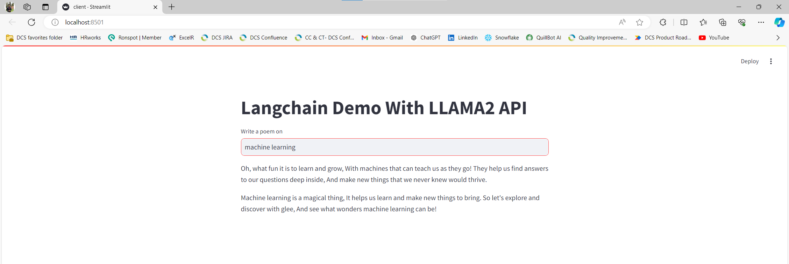
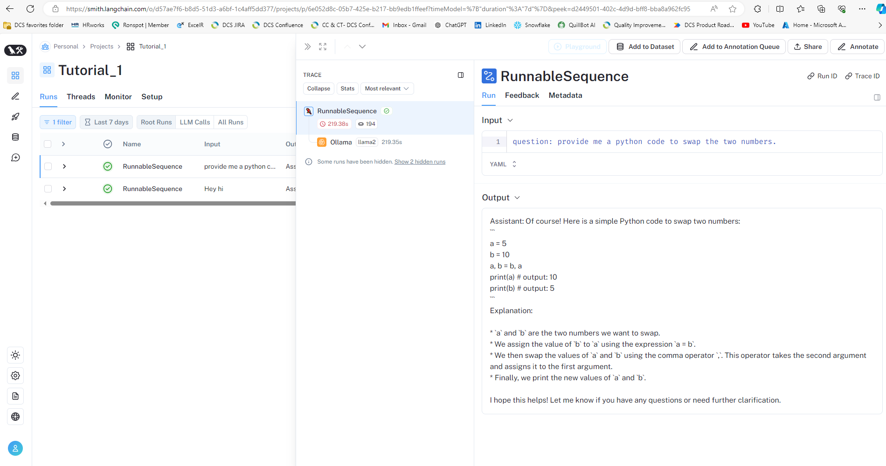
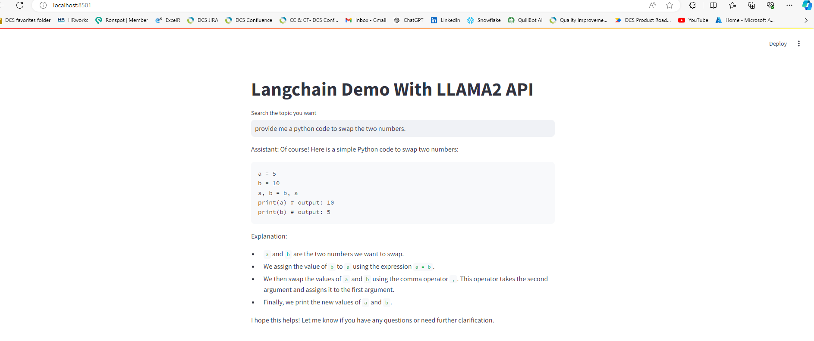
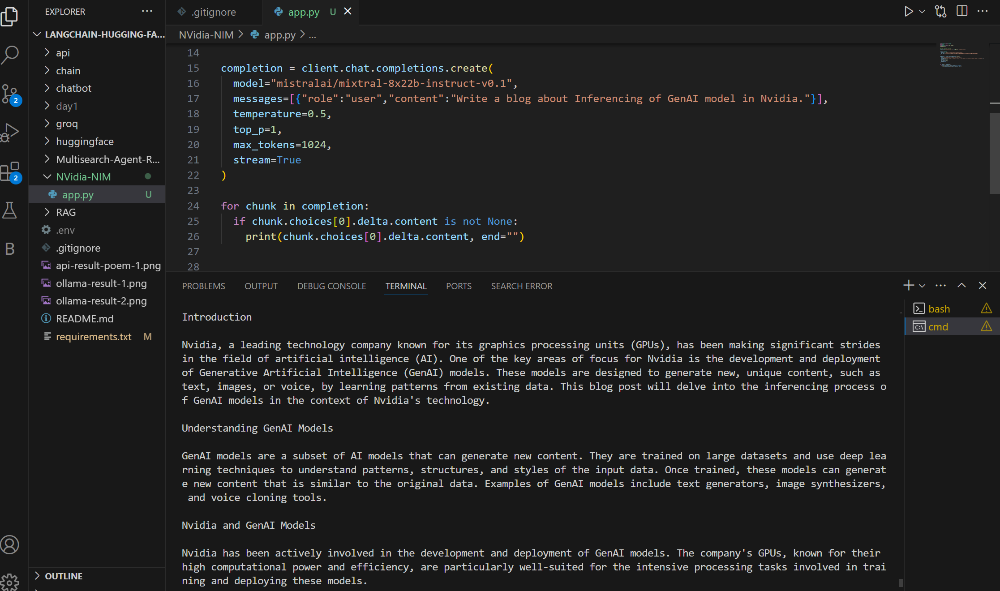

# Create ChatBot similar like ChatGPT.
We create this ChatBot using Paid LLM or Opensource LLM models.

- Paid LLM: OpenAI API, Anthropic
OpenSource LLM: It wll run on smith.langchain portal. https://smith.langchain.com/

- OpenSource LLM:
    1) Download the OLLAMA. OLLAMA helps us to run all LLM locally.  
https://github.com/ollama/ollama

## Langchain Chatbot demo with Llama2 API:

## Ollama Chatbot Results:
 

## Mistralai Chatbot using NVidia Embedding Inferencing  Results:

 